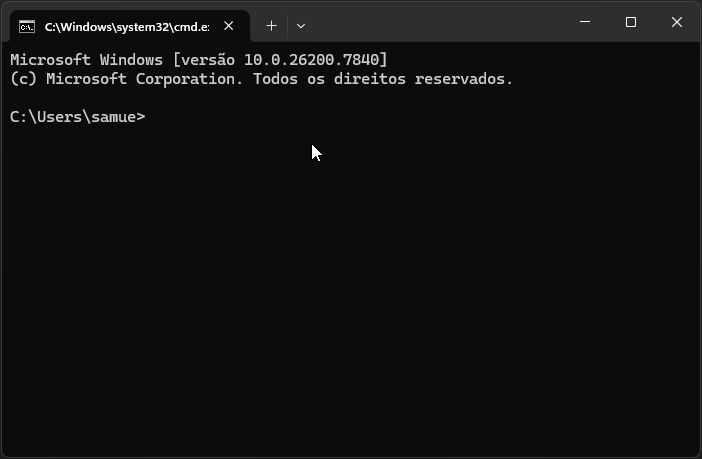
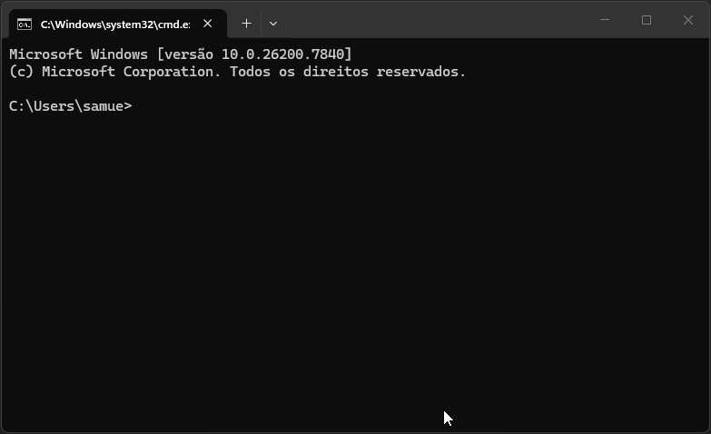

# rbxbundle


`rbxbundle` extracts Roblox `.rbxmx` and `.rbxlx` files into a compact bundle that is easier to inspect, version, and send to AI tools.

It keeps the useful parts of the project structure:
- scripts as `.lua` files
- hierarchy and index files
- attributes and optional context objects
- dependency graph outputs
- a `SUMMARY.md` designed to be the first file you share with an AI

## Demo

### CLI build

<!-- Replace with:  -->
`docs/demo-build.gif`

### Interactive mode

<!-- Replace with:  -->
`docs/demo-interactive.gif`

## Why use it

Roblox XML exports are noisy. Sending raw `.rbxmx` files to an AI wastes context on markup instead of code and structure.

`rbxbundle` turns that export into a smaller, readable package focused on what matters.

## Installation

Requirements: Python `3.9+`.

```bash
git clone https://github.com/samuelffer/rbxbundle.git
cd rbxbundle
pip install .
```

Check the installed version:

```bash
rbxbundle --version
```

## Quick start

Build a bundle:

```bash
rbxbundle build MyModel.rbxmx
```

Inspect without writing files:

```bash
rbxbundle inspect MyModel.rbxmx
```

List supported files in a directory:

```bash
rbxbundle list --dir ./models
```

Run interactive mode:

```bash
rbxbundle
```

## Main commands

```text
rbxbundle build <file> [--output DIR] [--no-context]
rbxbundle inspect <file>
rbxbundle list [--dir DIR]
rbxbundle --mode interactive
rbxbundle --mode argparse
rbxbundle --version
```

Supported input extensions:
- `.rbxmx`
- `.rbxlx`
- `.xml`
- `.txt` with valid Roblox XML content

## Output

Each build generates `<name>_bundle/` plus a `.zip` with the same contents.

Core files:
- `SUMMARY.md`: high-level project overview
- `HIERARCHY.txt`: instance tree
- `INDEX.csv`: script inventory
- `scripts/`: extracted Lua files
- `ATTRIBUTES.txt` and `ATTRIBUTES.csv`: extracted attributes
- `DEPENDENCIES.json` and `EDGES.csv`: dependency graph outputs

Optional or conditional files:
- `CONTEXT.txt`: context objects when context export is enabled
- `DEPENDENCIES_ERROR.txt`: written when dependency analysis fails but bundle generation still completes

## Using with AI tools

1. Run `rbxbundle build YourModel.rbxmx`.
2. Upload the generated `.zip` or bundle folder contents.
3. Start with `SUMMARY.md`.
4. Reference scripts by their extracted path.

## Using as a library

```python
from pathlib import Path

from rbxbundle import create_bundle

bundle_dir, zip_path, scripts = create_bundle(
    Path("MyModel.rbxmx"),
    output_dir=Path("output"),
    include_context=True,
)
```

## Tests

```bash
python -m unittest discover tests -v
```

## License

MIT. See [LICENSE](LICENSE).
